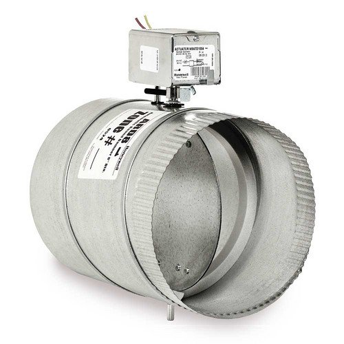
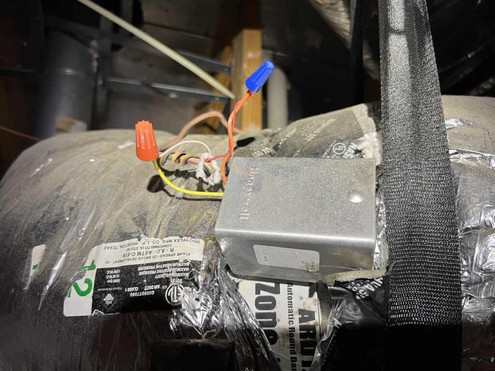
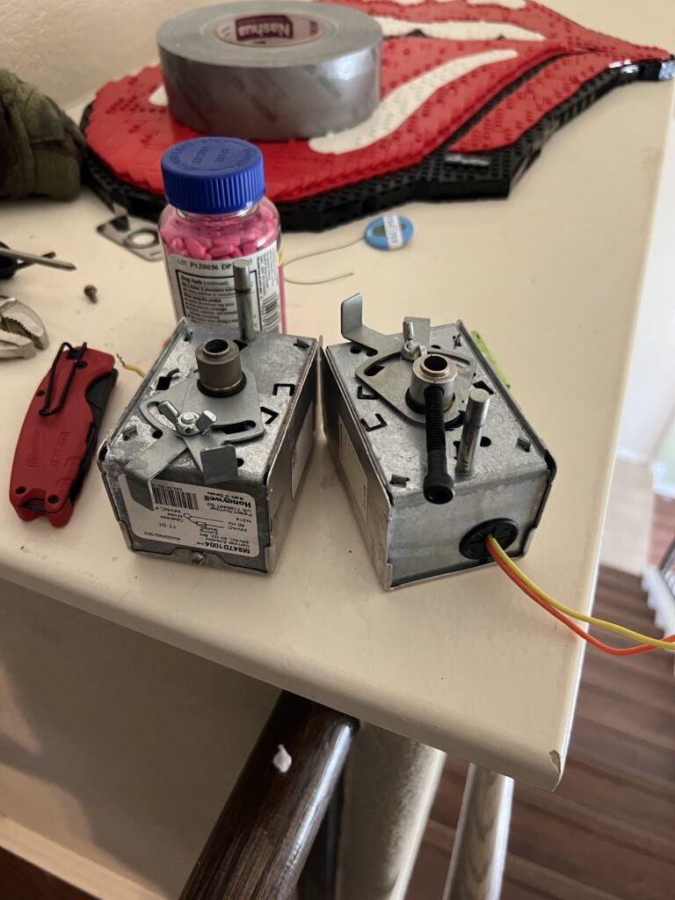
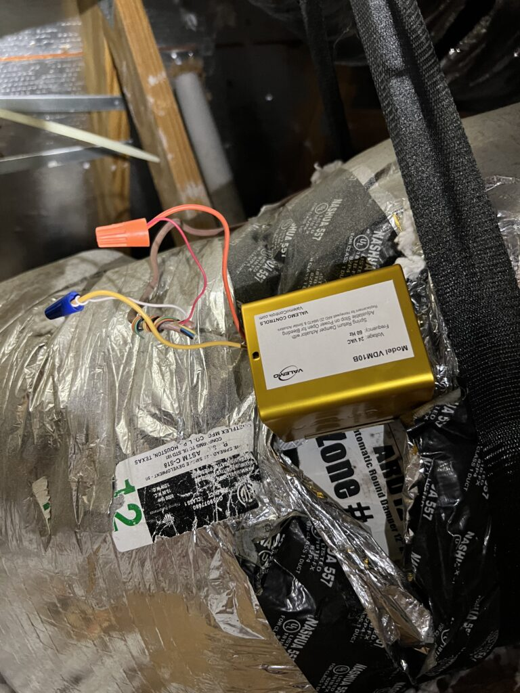
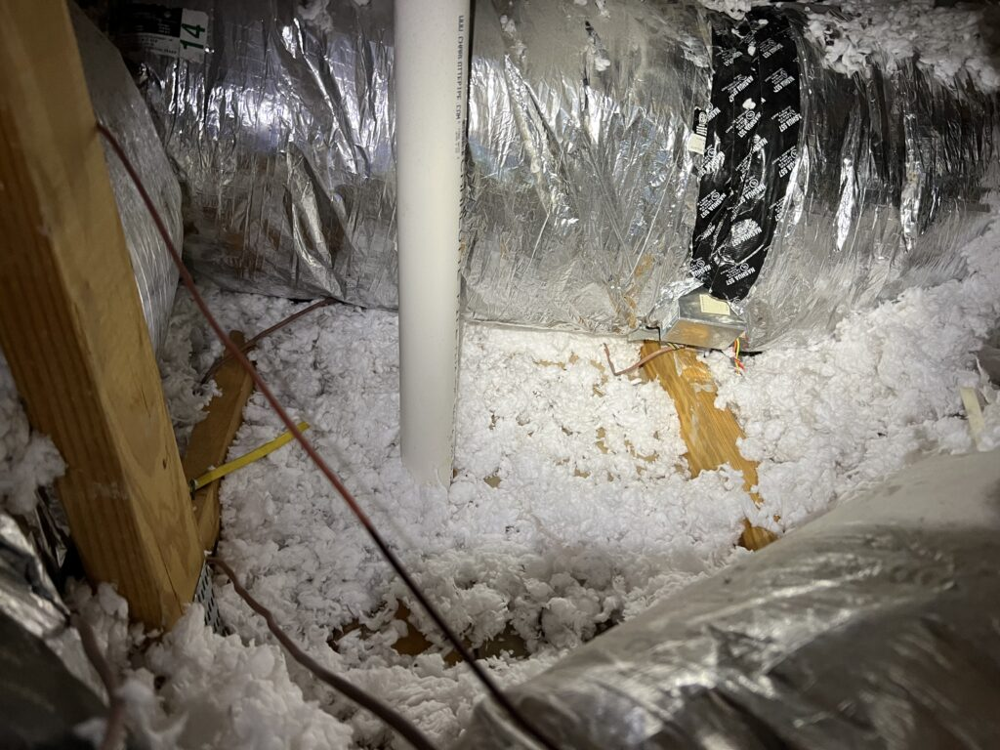
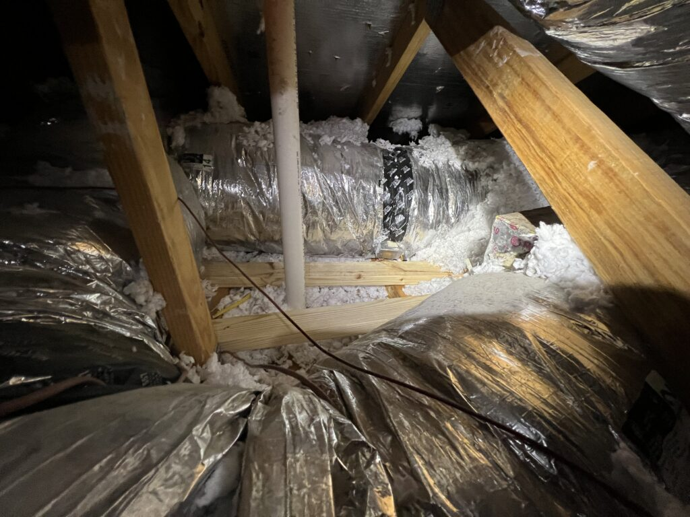
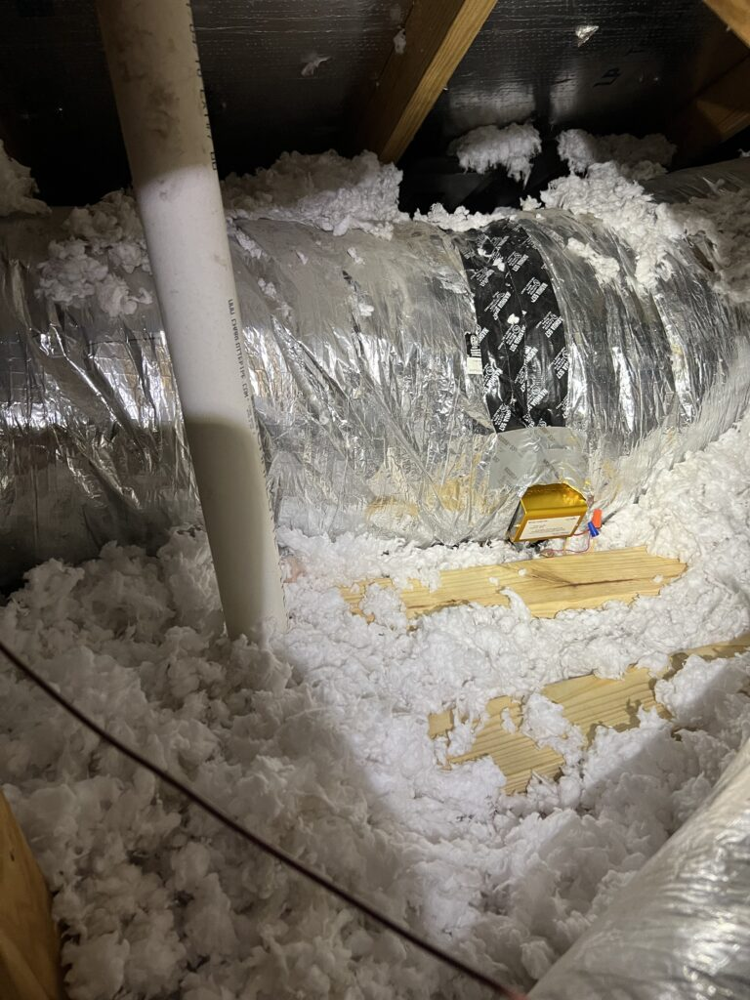

## The Issue

I have a two story house with a 2-zone air conditioning system, one zone for downstairs, and one for upstairs. One day, it seemed impossible to cool the upstairs, and the downstairs was getting plenty of ventilation.

After doing some research, these zones are controlled by something called a zone damper.

You can see in the image above, the damper is a duct with a metal door that opens and closes, with a motor that sits on top to either open or close the damper.

These dampers have different default starting positions:

- Power open: By default, the damper is sprung closed, and when called for, the motor will power the damper open.

- Power closed: By default, the damper is sprung open, and when called for, the motor will power the damper closed.

In most cases, the motor will fail and that is the only thing that will needed to be replaced. Unless there is physical damage to the damper/ductwork itself, there is no need to replace the damper.

## Diagnosis

Back to my case, the damper for the upstairs zone was power open, meaning, it was closed by default. I determined that the motor did fail, and needed to be replaced.

I made this determination by first turning on the A/C for the upstairs zone, while turning off the A/C for the downstairs zone. In theory this should mean that the downstairs zone damper is closed and the upstairs zone damper is open.

I confirmed the downstairs zone damper was closed, but the upstairs zone damper was closed too.

I then turned on the A/C in the downstairs zone, and off in the upstairs zone. I confirmed the downstairs zone damper was open, and the upstairs zone damper was closed.

So the upstairs zone damper was not properly opening when needed.

## Replacing the Motor

**I turned off the power** and went up in the attic and found the zone damper motor. You can find the zone damper motor by looking for a rectangular box on top of the ductwork.

I found that I had Honeywell M847D1004 damper motors. After doing some digging on Amazon, [I found a replacement by Valemo](https://www.amazon.com/gp/product/B0868C89Q7) for this model and bought two.

Once the motors arrived, I got to work.

Replacing the motor is fairly straight forward. First you'll want to disconnect the power and ground wires.

Once that is done you'll want to loosen the set screw. This set screw is somewhere underneath the motor, mine happened to be at the bottom. This set screw was for an Alan wrench, which made it easy to get to. You do not need to completely remove the set screw, just unscrew it enough to where you can pull the motor straight out.

As you can see on the motor on the right, the black screw is the set screw referenced above. Additionally, you'll notice the metal bar sticking out. This fits into the damper housing and acts as a fixed point to ensure the damper itself doesn't rotate. Then you have the actual center piece of the motor which rotates the damper door.

Before sliding the new damper motor on the damper, ensure that the damper door is in the correct starting position:

- If your damper is power open, the starting position is **closed**

- If your damper is power closed, your starting position is **open**

Once the damper door is in the correct starting position, fit the new damper motor on, and tighten the set screw in the proper orientation.

Once the new motor is installed, reconnect the power and ground wires.

Now you can turn your power back on and test the diagnosis steps above. Except now, when calling for A/C in the zone with the motor you just replaced, you should see the damper door properly open/close now.

## Replacing the other zone motor

Since I bought two motors off Amazon just in case and I was already up in the sweaty attic, I decided I would replace the other zone motor as well.

Unfortunately for me this motor wasn't as easy to get to. My attic is quite small with little to no walkways. I was practically a contortionist trying to get to this motor without putting any pressure on the attic floors.

On top of that, I had to move around some insulation as well. I swept and relocated the insulation, make sure to wear a mask for this, and let it settle for an hour or two.

I then got some 2x4s and placed them on the joists by the motor so I could support myself while replacing the motor.

Then, repeated the steps above. Once I got the new motor in, I replaced the insulation and cleaned up the space.

## Lessons Learned

A few lessons learned from this:

- Try to optimizing the time of day/time of year you are doing this repair if possible. I got lucky doing this in April in Texas and even after only 20 minutes in the attic I was completely drenched in sweat.

- If you have little or no light in your attic get something like an [OLight](https://www.olightstore.com/baton-3-pro-small-rechargeable-flashlight.html) with a clip and clip it to your hat. Either that or a headband light. Carrying your phone is not an option.
