My backyard has gone through some changes these past couple of years. Most recently, a mix of soil, weeds, and some grass.

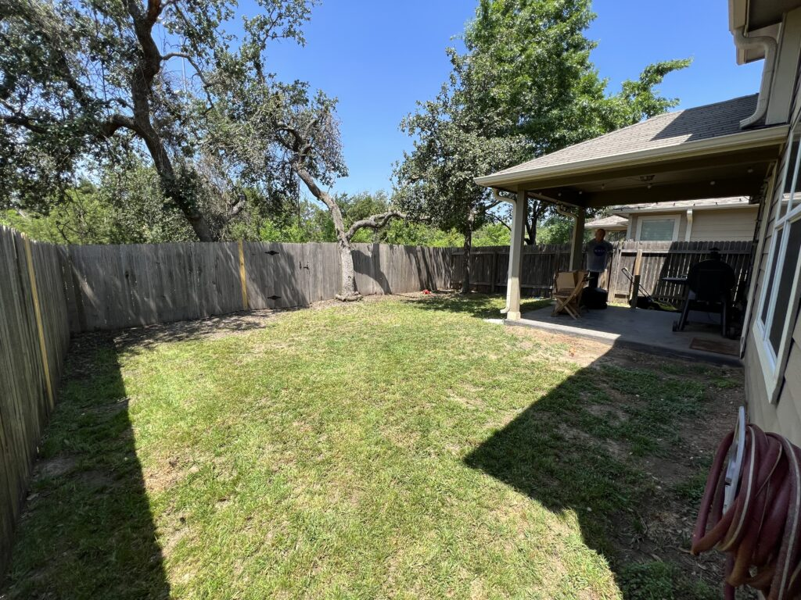

This area was prone to creating a lot of mud when it rains. The drainage was pretty poor from a previous failed tilling attempt. Having a dog and mud don't mix very well, so I decided it was time to renovate this space with some sod.

I first started by mowing what grass and weed I had to the lowest setting my mower would go to. Then I put some flags up for each irrigation zone so I knew where they were.

Next step was to till the entire space to bring up and loosen the soil:

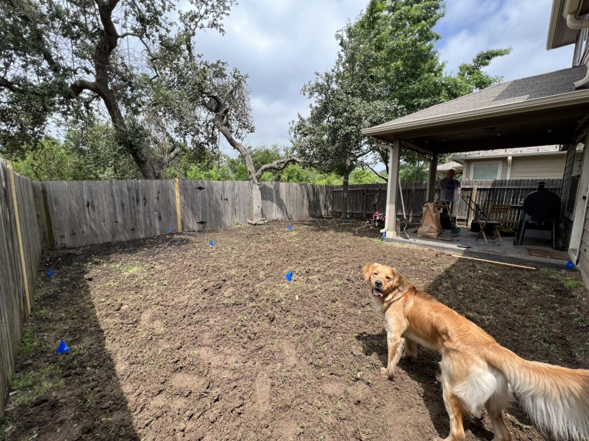

I tilled as close as I could to the irrigation heads, and then dug with a shovel to loosen up the soil nearest the heads.

The tiller I ended up renting from Home Depot was the Mid Tine Tiller from Honda. It worked great.

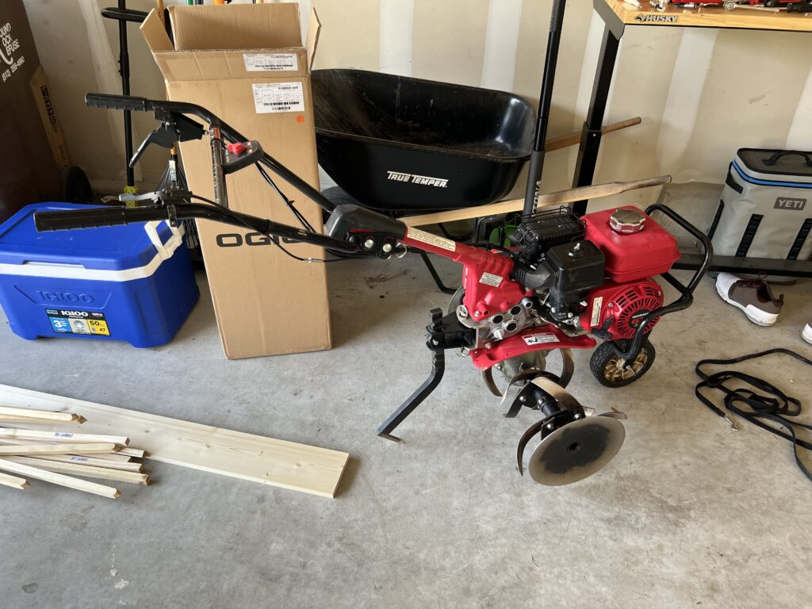

Once everything was tilled and fresh, I raked as much as I could of the dead grass, rocks, or anything that would complicate laying down sod.

Next up was establishing the grade. This was by far the most time consuming and back breaking work. As I mentioned before, I did a previous till which left the grade and level all out of whack.

The grade of the soil is important for a few reasons:

- Most importantly, you want a grade sloping down away from the foundation of the house so that water doesn't pool near the foundation

- Secondly, any pooling of water can kill grass or create mud

Firstly, you want to establish what percent grade you need. This will vary by location, but I decided a 4% grade would work for me.

To determine this, you could setup a stake from one side of the yard to the other and determine the change in elevation every x feet, but I decided to do it a bit different.

Instead, I used a Carpenter's level and a formula to determine how much grade I need in inches over a given area.

For example, say I want a 4% grade. A Carpenter's level is 4 ft., or 48 in. You can multiply 48 in. by the percent of grade (0.04):

**48\*0.04 = 1.92 in**

This means that the length of every Carpenter's level (4 ft), the ground should drop in elevation 1.92 in.

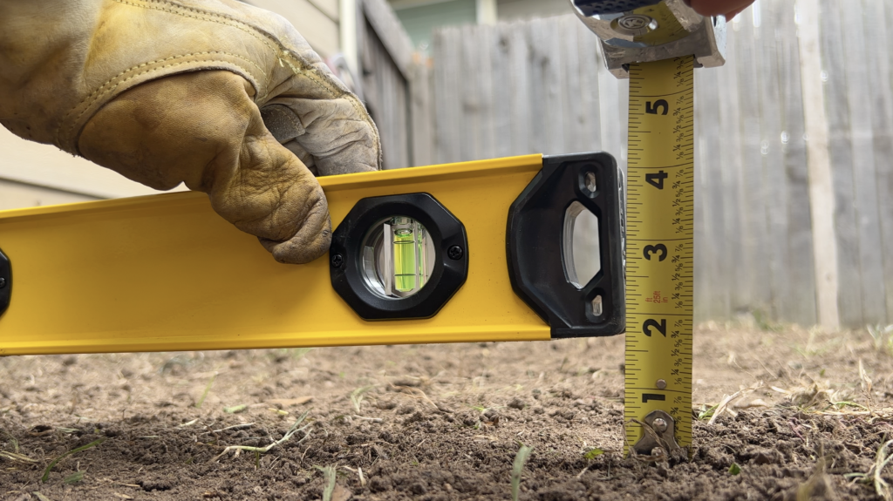

I had no way to get any large equipment in my backyard, so all the work done on establishing the grade was done with a rake and shovel. It was a complete b\*\*\*\* to be honest. I tried my best to get a 4% grade, but it's not perfect.

Once I had a decent grade, I raked and leveled the soil as best I could. I ended up getting a pallet from Home Depot, and dragging it like a sled to get things evened out and flat.

That was all the prep work, now it was just waiting on the sod to arrive (it took an extra week because of the rain). I went with [Zoysia Palisades from King Ranch](https://krturfgrass.com/product/palisades-zoysia/). Zoysia is very good for foot traffic and pets, it also is pretty drought tolerant. From King Ranch's website:

> "In fact, some studies have shown it to survive up to 15 weeks without water. Another crucial distinguishing point about Palisades Zoysia is that it can be mowed to as low as ½ inch in height. This aspect of the grass, along with its hardiness in dry conditions, makes it an ideal turf for golf course fairways and roughs – and, of course, for residential lawns."
> 
> https://krturfgrass.com

My backyard was a total of 1100 sqft, which came out to 2 and 1/2 pallets of sod. King Ranch was able to deliver full pallets, but any halfs you had to pick up yourself. So I had the two whole pallets delivered while I rented a trailer from Home Depot and picked up the half pallet:

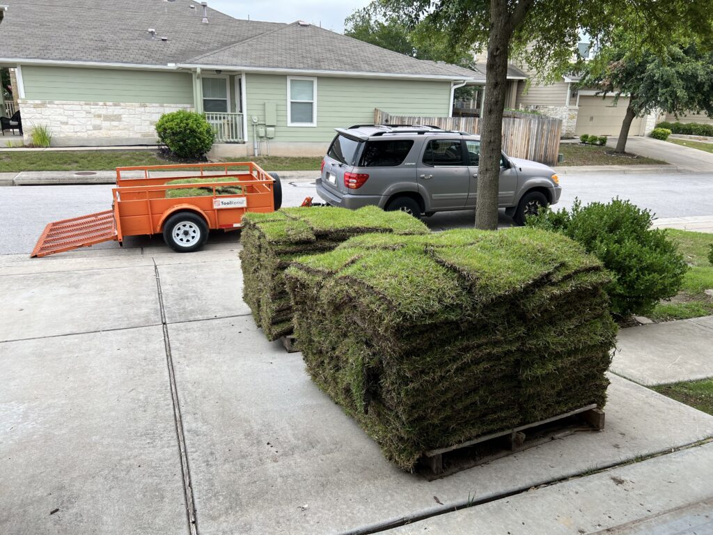

Now it was time to start laying the sod. I got about one row in and noticed how many trips I was taking back and forth in my wheel barrow. A lot of people talked online about using a [Gorilla Cart](https://gorillamade.com/product/gcg-7/), but I didn't think I needed it.

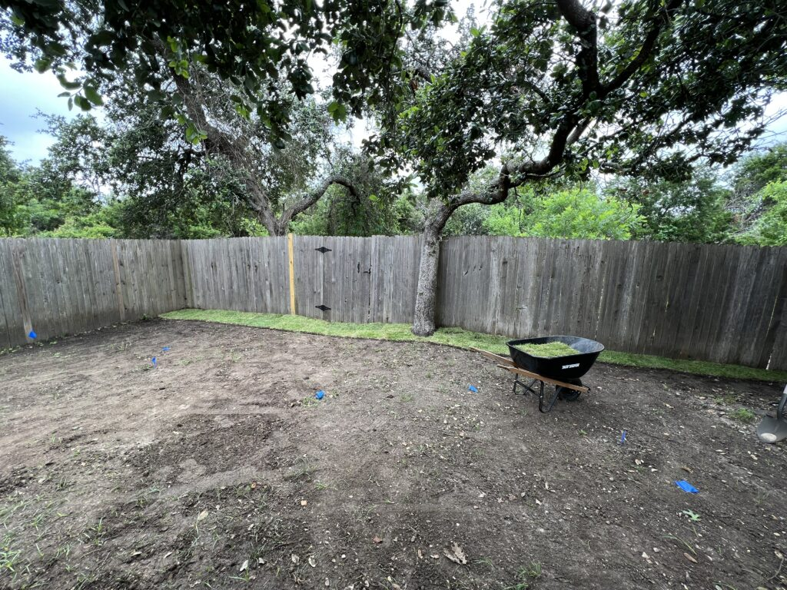

I also watered the sod after every couple of rows just to make sure it was staying fresh:

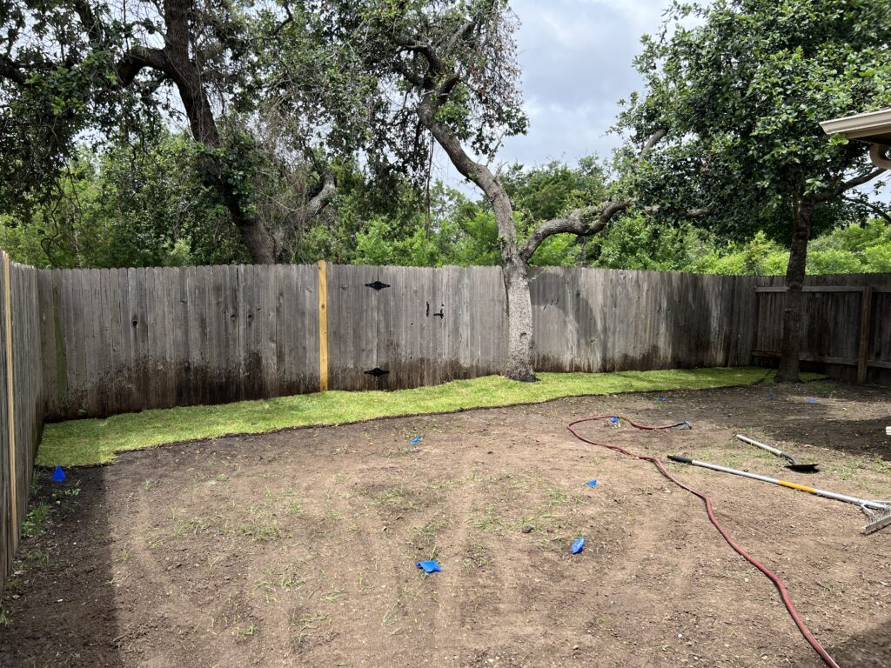

But as I took more and more trips, I realized how little this wheel barrow could hold. I was counting only 7 pieces of sod each trip. So I decided to make a quick trip to Home Depot to test out the [Gorilla Cart](https://gorillamade.com/product/gcg-7/). It did not disappoint at all. I was able to get about 25 pieces of sod each trip now. If there is any tool that made this job a requirement it was this.

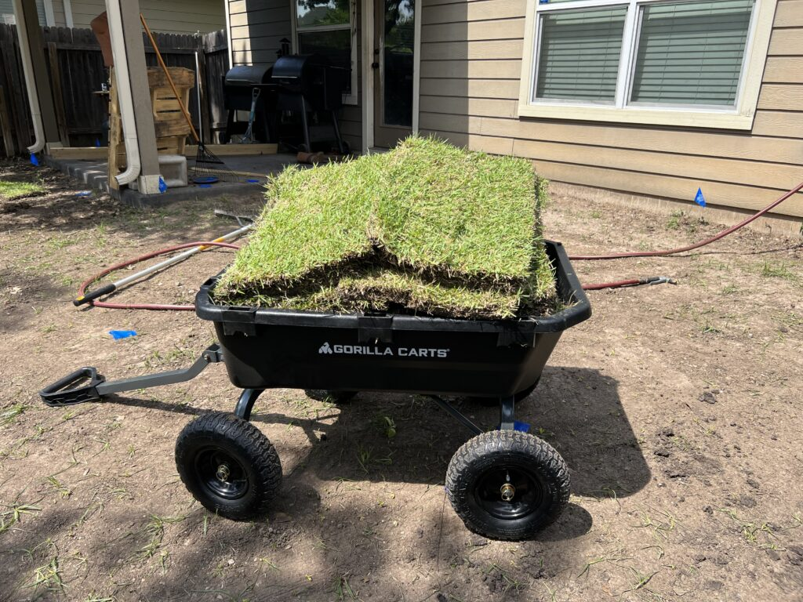

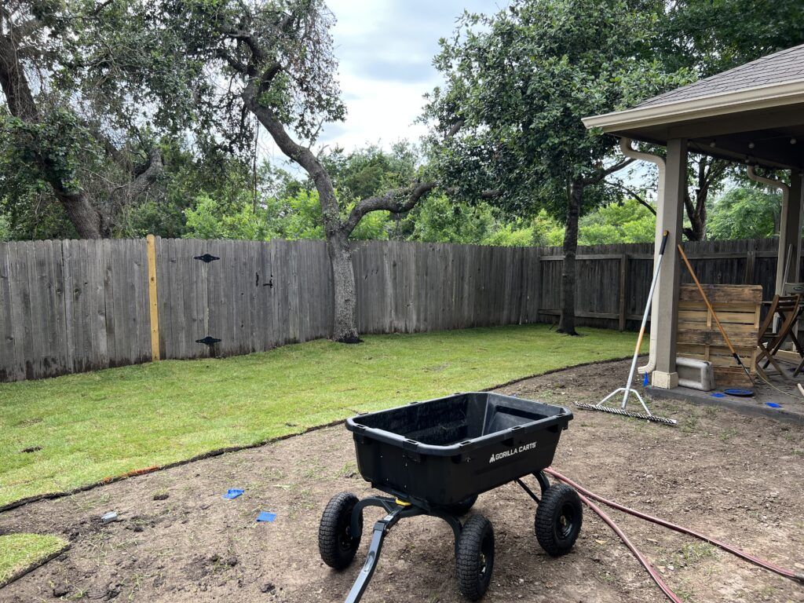

After about 12 hours straight of laying sod (7am-7pm) I was finally done:

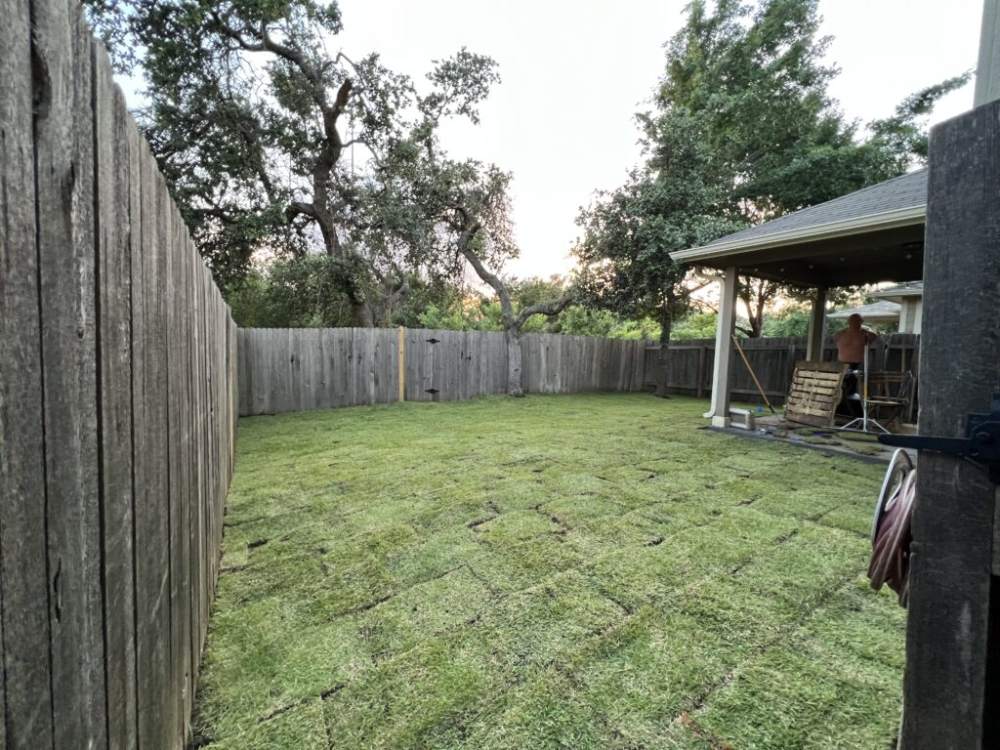

Unfortunately the last batch of sod had some pretty rough edges, so I had to make do with what I had. The corners that didn't match up I filled with top soil for an even surface.

The next day, I went over any imperfections with top soil and then prepped the roller that I rented from Home Depot. I only filled this roller about 1/4 of capacity to not damage the sod, I just wanted to make sure the sod was making good contact with the soil.

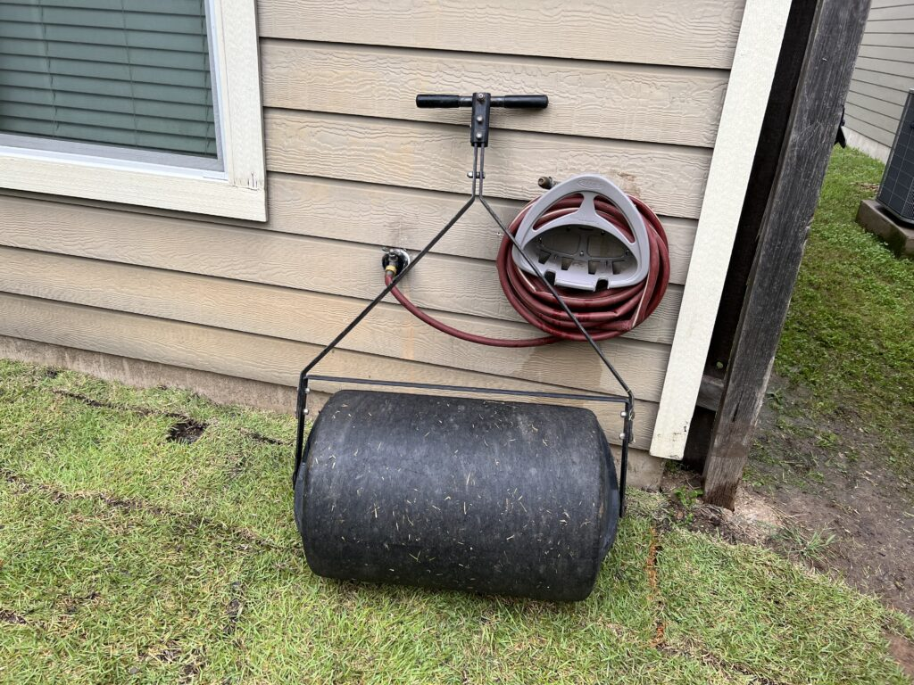

Upon completion of installing the sod, I watered it in for 40 minutes straight.

Now, for the next two weeks, I'll be watering 3 times a day, for 20 minutes each. I'm following this chart for my watering protocol:

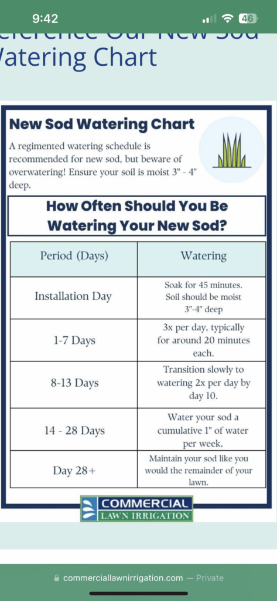

Here's a final look at how it turned out:

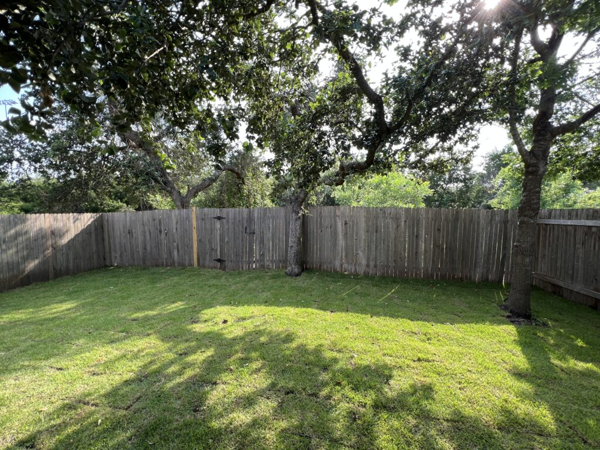

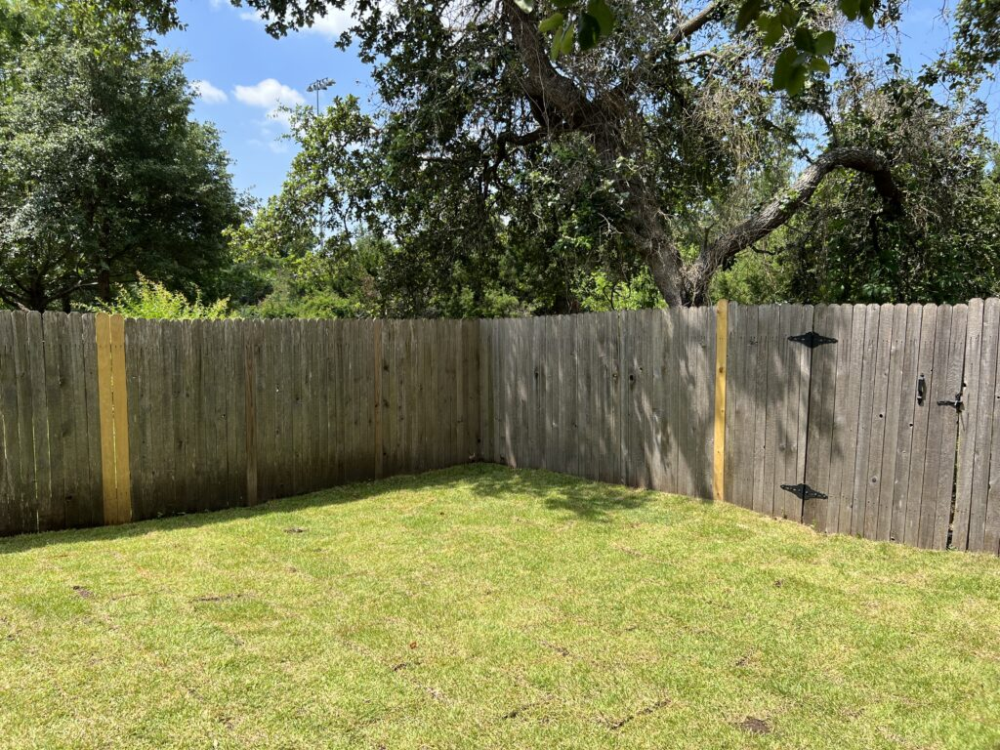

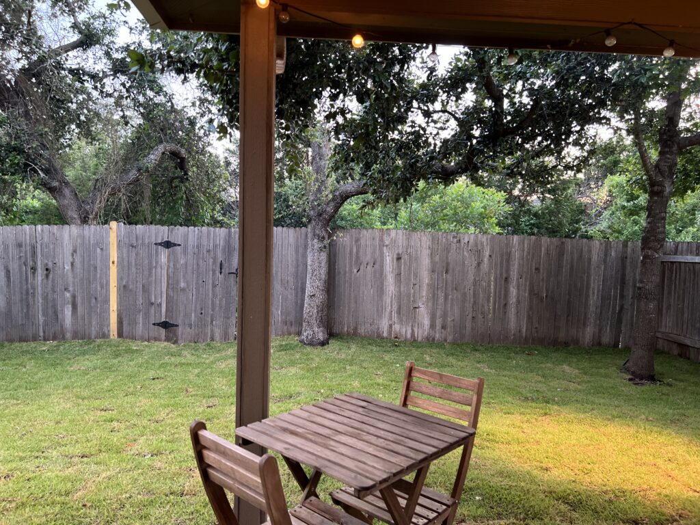
