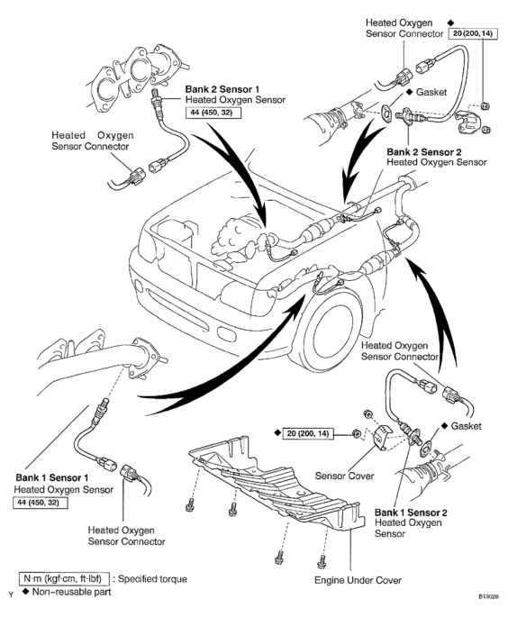
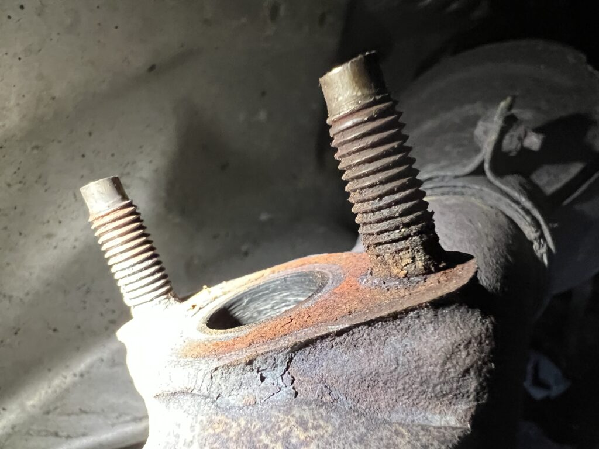
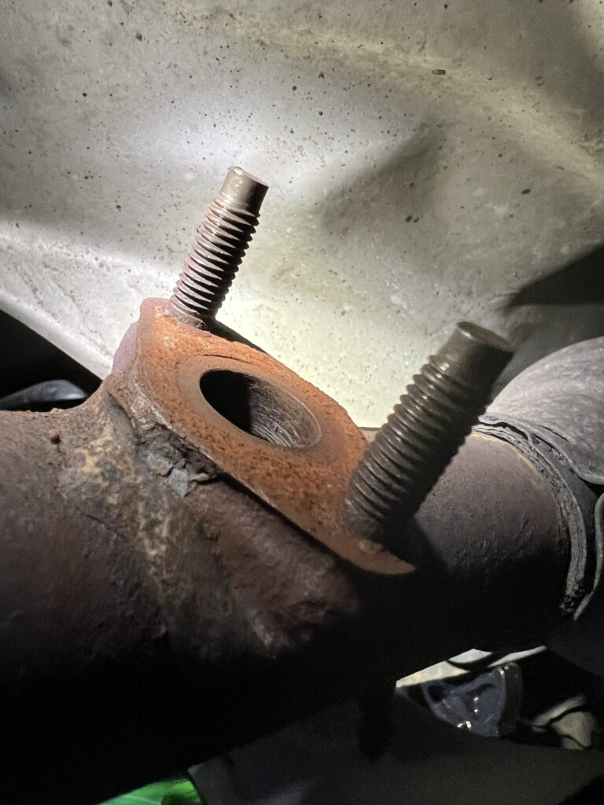
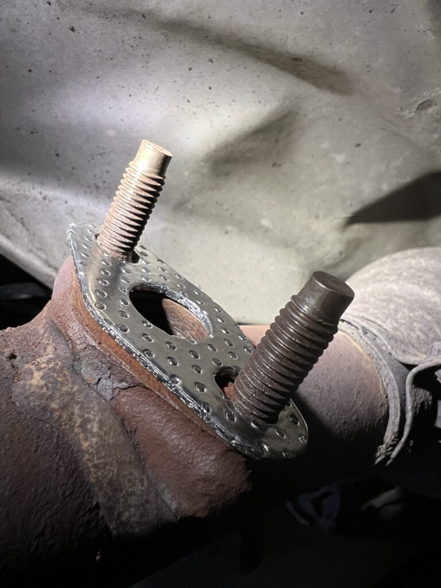
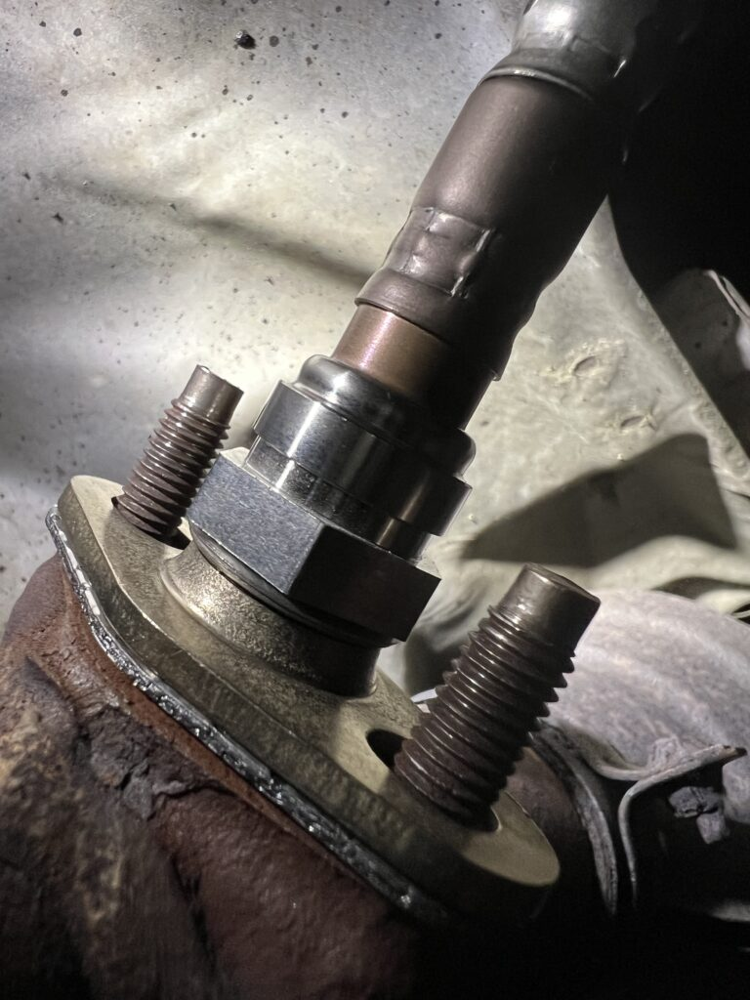
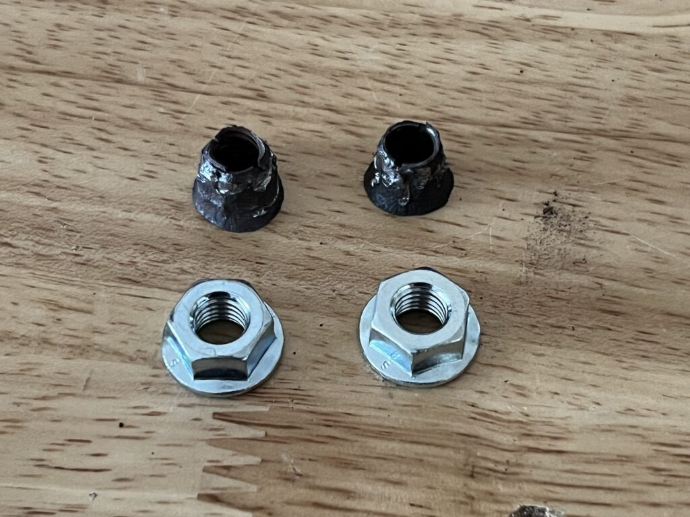
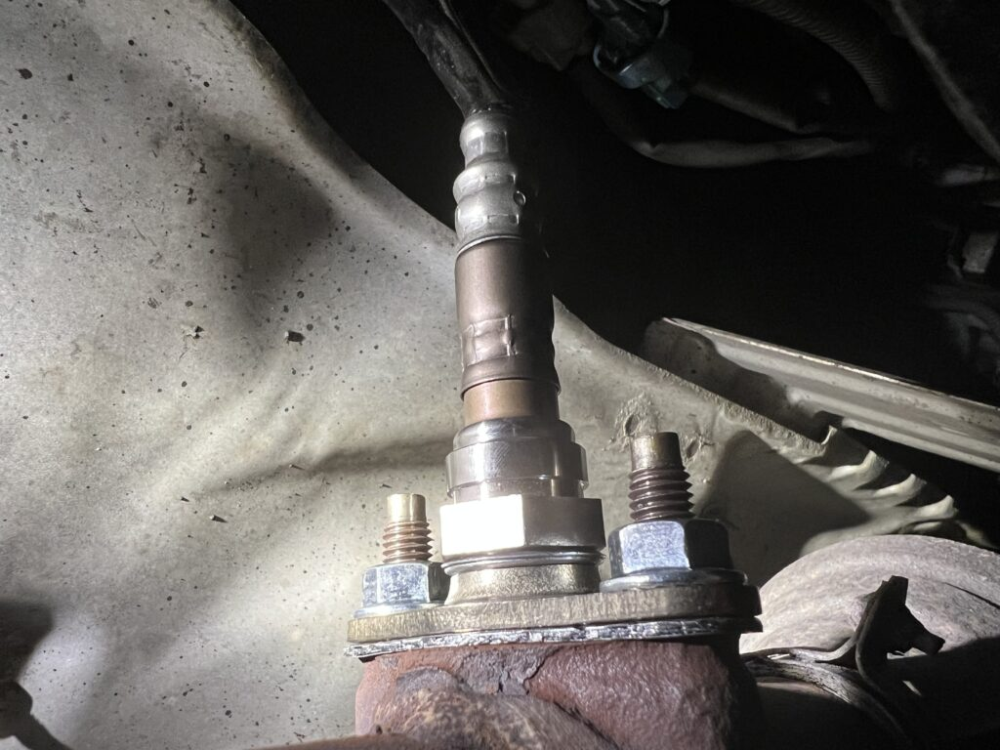

I recently replaced by downstream oxygen sensor in my 01 Sequoia trying to resolve an exhaust issue. This didn't fix it, but I thought I'd document the process in case it's helpful for any else.

First off, the Sequoia is a v8 engine with two exhaust manifolds, so you have two upstream O2 sensors, and two downstream O2 sensors.

Here is a diagram courtesy of [Toyota Guru](https://www.toyotaguru.us/sequoia-2004-repair/heated-oxygen-sensor.html):

Bank 1 is the driver side, and bank 2 is the passenger side. I replaced the Bank 1 downstream O2 sensor, which you can see sits after the catalytic converter on the driver side.

Here is what mine looked like:

As you can see, my car has got some rust. The nuts that secure the O2 sensor and heat shield in place don't even look like nuts here.

Start by unclipping the O2 sensor from the wiring harness, this will give you some more room to work as well.

Next, I used a nut extractor socket which helps get a grip on stripped or rusted nuts. Once I placed the socket on top of the nut, I hammered it down as much as I could to get a good seat on the nut:

This technique ended up working pretty good, and I didn't even need to use a breaker bar to free these nuts. Just took a little bit of finesse to release the rust.

Here's a look at the O2 sensor and nuts once I got them released:

And here is a look at the sensor entry point once I took the sensor off. Look at all that rust!

I took a wire brush to it to clean up the threads:

Make sure to remove the old gasket as well! It may be caked on pretty good.

Once you've got your area cleaned up, it's time to apply the new O2 sensor. I got mine off of Amazon, [here is the exact one I used.](https://www.amazon.com/gp/product/B07H2CM92W/ref=ppx_yo_dt_b_asin_title_o01_s00)

Start by adding the new gasket:

Then install your new sensor:

Since my old nuts were rusted and destroyed, I picked up some new ones from Home Depot. The new nuts I'm using were M8 with a 1.25 pitch.

Hitting the sensor entry point with a wire brush really helped a lot. I was able to hand thread the nuts on afterwards:

Finally, I reconnected the wiring harness. Here is a look at the finished result:

If you have a scan tool with live data, you may also want to check to be sure that the O2 sensor is sending the proper voltage.
